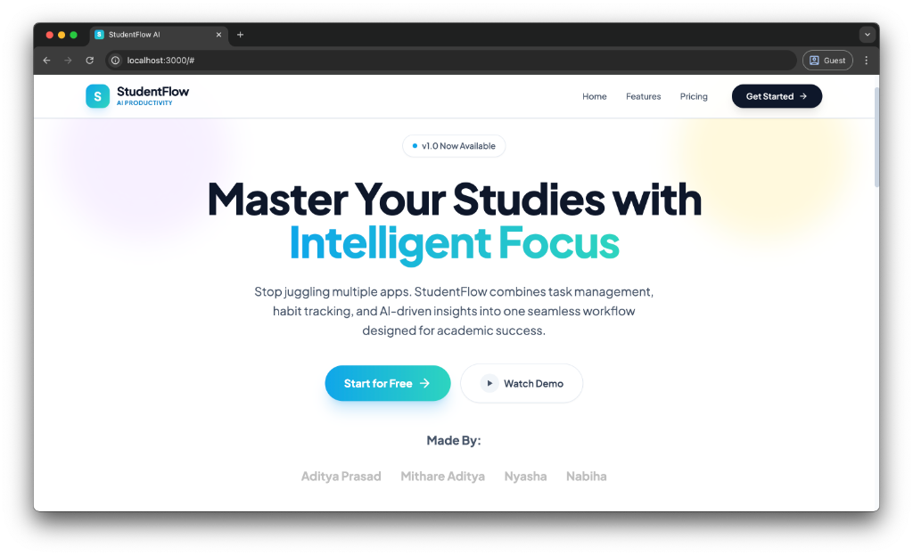

# StudentFlow - Student Productivity Tracker

StudentFlow is a comprehensive student productivity application designed to help students manage tasks, track daily routines, and gain insights into their study habits. It features a modern, responsive UI and a robust backend API.

- [Click here (Hosted on AWS EC2 t3.small)](http://98.130.52.208:5173)
- [Demo Video](https://drive.google.com/drive/folders/1hklEpm23_jBYWJU8FBpL48gk7i3Dueur?usp=sharing)



## Local Setup

To Try it on your local machine, refer this
[Setup Guide](./docs/setup.md)

```bash
docker-compose -f docker-compose.dev.yml up --build
```

## Features

- **Dashboard**: Visual overview of weekly progress and upcoming tasks.
- **Task Manager**: Create, edit, prioritize, and categorize tasks.
- **Routine Logger**: Track daily habits like study hours, sleep, and wellbeing.
- **AI Planner**: Generate study plans using AI (Google Gemini).
- **Focus Timer**: Built-in timer for focused study sessions.
- **Insights**: Analytics and charts to visualize productivity trends.
- **Customization**: Dark mode and color themes (Ocean, Royal, Sky, Sunset).

## Tech Stack

### Frontend

- **Framework**: React.tsx (Vite)
- **Styling**: TailwindCSS
- **Icons**: Lucide React
- **Charts**: Recharts
- **Auth**: Firebase Client SDK

### Backend

- **Runtime**: Node.js
- **Framework**: Express.js (in TypeScript)
- **Database**: MySQL
- **ORM/Driver**: mysql2
- **Auth**: Firebase Admin SDK (Token Verification)
- **AI**: Google Generative AI (Gemini)
- **Testing**: Postman, ThunderClient

### DevOps

- **Containerization**: Docker, Docker Compose

## 📂 Project Structure

```
SprintX/
├── backend/            # Node.js/Express API
│   ├── src/
│   │   ├── config/     # DB and App config
│   │   ├── controllers/# Route logic
│   │   ├── middlewares/# Auth and Error handling
│   │   ├── routes/     # API endpoints
│   │   └── ...
├── frontend/           # React Application
│   ├── src/
│   │   ├── components/ # Reusable UI components
│   │   ├── services/   # API client services
│   │   └── ...
├── docs/               # Documentation
└── docker-compose.dev.yml  # Container orchestration
```

## Note (**IMPORTANT**)

- We had actually planned to include Redis (an in memory database) for caching data for faster data access, but due to time constraints we are caching the data in browser localstorage with an expiry of 15-20 seconds.

- We had also deployed this project on AWS EC2 under the free tier model of t3.micro but as the limits of this model is 1 GB RAM, it crashed and now the website is hosted on t3.small which has constraints of 2 GB RAM. The server might have crashed due to less RAM under the free tier, so feel free to try this out locally

## Quick Start

### Prerequisites

- Docker & Docker Compose installed.
- A `.env` file in the root directory (see `.env.example`).

### Running with Docker

1.  **Clone the repository**

    ```bash
    git clone <repo-url>
    cd SprintX
    ```

2.  **Configure Environment**
    Copy `.env.example` to `.env` and fill in your credentials (MySQL, Firebase, Gemini).

    ```bash
    cp .env.example .env
    ```

3.  **Start the Application**

    ```bash
    docker-compose up --build
    ```

4.  **Access the App**
    - Frontend: `http://localhost:5173`
    - Backend API: `http://localhost:5000`

## Documentation

- [Architecture Overview](./docs/architecture.md)
- [Setup Guide](./docs/setup.md)
- [API Design](./docs/api-design.md)
- [Database Schema](./docs/db-schema.md)
- [Test Report](./docs/test_report.md)

# Contributors

AIML-3, 3rd Sem BMSIT

- Aditya Prasad -> (Team Lead, Fullstack Engineer, Basic DevOps, Team Coordinator and Debugger)
  [LinkedIn](https://www.linkedin.com/in/aditya-prasad-095ab9329/)

- Mithare Aditya -> (Frontend Engineer, Prompt Engineer, Debugger)
  [LinkedIn](https://www.linkedin.com/in/aditya-mithare-52356a333/)
- Nyasha Chauhan -> (UI Testing, API Testing, Server Testing, Unit testing, Docs manager)
  [LinkedIn](https://www.linkedin.com/in/nyasha-chauhan-2a6935357/)
- Nabiha Fathima -> (Frontend Engineer)
  [LinkedIn](https://www.linkedin.com/in/nabiha-fathima-s-8b4670357/)
