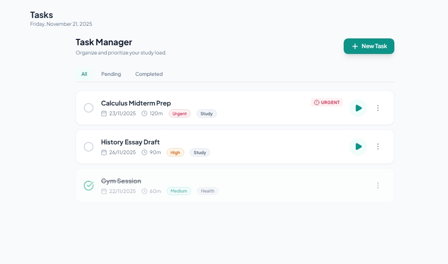
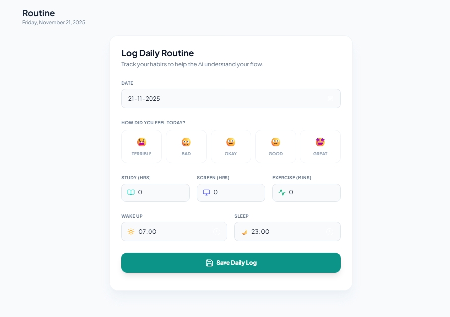

#test report
Tester: Nyasha
Date: 21-11-25

1. Smoke Test (Basic Load Test)
- Application opened at: http://localhost:3000  
- Sidebar loaded successfully  
- Dashboard loaded without console errors  
- Vite server responded correctly  

*Status:* PASS
---

## 2. Navigation Test
*Visited Pages:*
- Dashboard → PASS  
  Screenshot : 
- Task Manager → PASS 
  Screenshot : 
- Routine Logger → PASS
  Screenshot : 
- AI Planner → PASS  

---

## 3. Task Manager Testing

### ✔ Add Task  
Steps:  
1. Open Task Manager  
2. Enter task “Study Math”  
3. Select priority: High  
4. Click Add  

Expected: Task should appear in list  
Actual: Task appears correctly  

*Status:* PASS  
*Proof:* task_add.png  

### ✔ Mark Complete  
Status icon changes → color updates  
*Proof:* task_complete.png  

### ✔ Persistence After Refresh  
Page refreshed → Task still present (localStorage working)  
*Proof:* task_persist.png  

### ✔ Delete Task  
Delete button worked correctly  
Task removed from UI + localStorage  

*Status:* PASS  

----

###4. Focus Timer Testing

----

## 5. Routine Logger Testing

### ✔ Add Routine  
Routine added successfully  
*Proof:* routine_add.png  

### ✔ Persistence After Refresh  
Routine remains after refresh  
*Proof:* routine_persist.png  

### ✔ Validation  
Empty routine submission → (mark result here based on what you see)  
- PASS / FAIL

## 6. AI Planner Testing

### ✔ Valid Prompt  
Prompt: “Create a 2-hour study plan for maths.”  
AI response generated successfully  
*Proof:* ai_valid.png  

### ✔ Empty Prompt Validation  
Expected: Should show error  
Actual: (Mark PASS/FAIL)  
*Proof:* ai_empty.png  

### ✔ Offline/Network Failure Handling  
Turned WiFi off → clicked “Generate”  
Expected: Error message displayed  
Actual: (Mark PASS/FAIL)  
*Proof:* ai_offline.png  

---

## 7. Settings

