# 🌟 **StudentFlow – Student Productivity Tracker**  
### **Comprehensive Quality Assurance Test Report**  
**Tester:** Nyasha Chauhan
**Date:** 21-11-2025  

---

# 🧪 **Quality Summary**
All major modules were tested for functionality, usability, persistence, error handling, and navigation stability.  

---

# 1️⃣ **Smoke Test**

| Test Case | Expected Outcome | Result | Notes |
|-----------|------------------|--------|--------|
| Launch AWS Deployment | App loads without errors | ✔ PASS | No console warnings |
| Sidebar Rendering | All navigation links appear correctly | ✔ PASS | Smooth transitions |
| Route Stability | All pages load with no crashes | ✔ PASS | Stable rendering |

---

# 2️⃣ **Dashboard Testing**

### **Objective:** Validate analytics, productivity metrics, charts & UI.

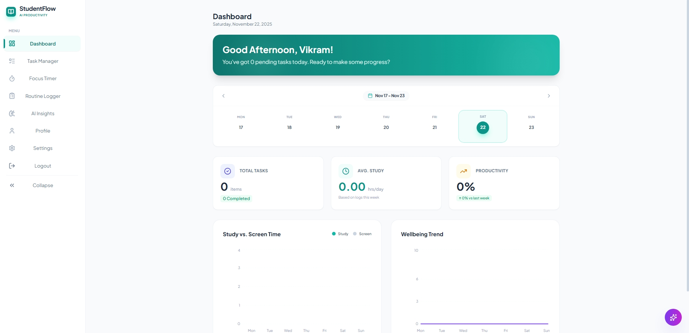

**Status:** ✔ PASS  
Dashboard charts and widgets rendered correctly with no lag.

---

# 3️⃣ **Task Manager Testing**

### ✔ **Add Task**
- Input: “Study Math”, Priority: High  
- Task appears immediately  

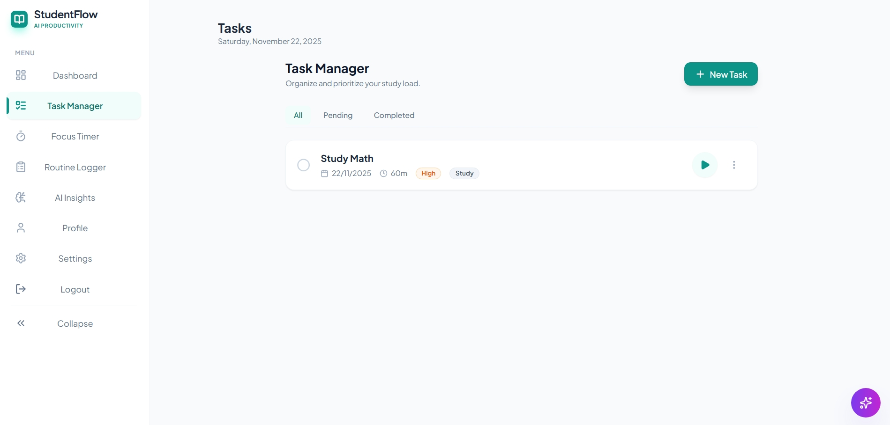

### ✔ **Mark Complete**
- UI state updates visually  

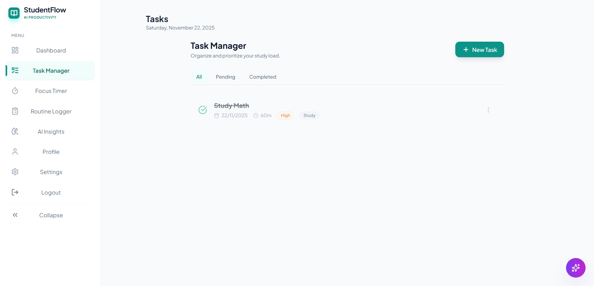

### ✔ **Persistence Check**
- Task remains after page refresh  

### ✔ **Task Manager Page**

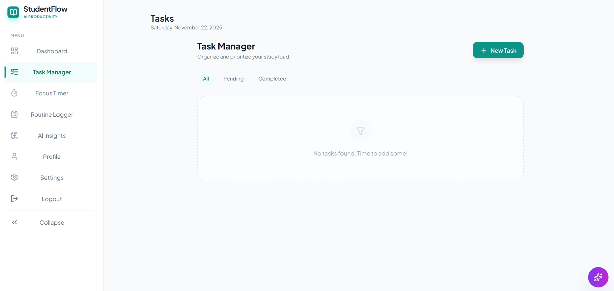

**Status:** ✔ PASS

---

# 4️⃣ **Focus Timer Testing**

| Action | Expected Behavior | Result |
|--------|--------------------|--------|
| Default Load | Timer shows initial value | ✔ PASS |
| Start Timer | Countdown begins smoothly | ✔ PASS |
| Pause Timer | Halts immediately | ✔ PASS |
| Reset Timer | Resets to base time | ✔ PASS |

  
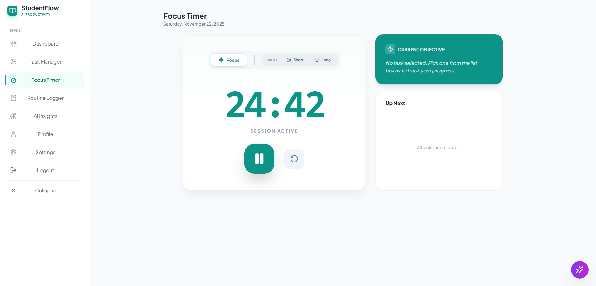  
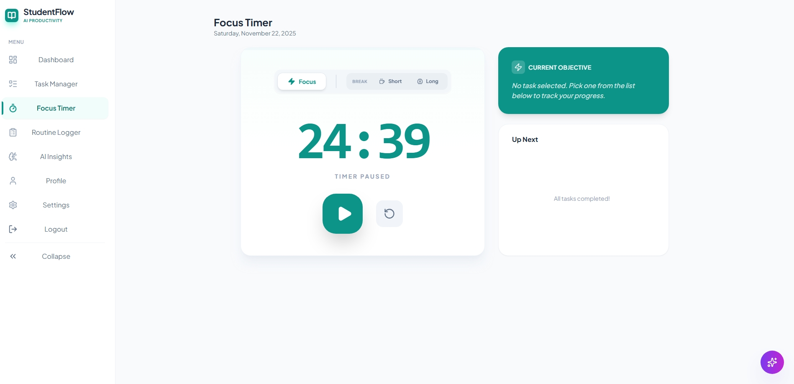  

---

# 5️⃣ **Routine Logger Testing**

### ✔ Add Routine  

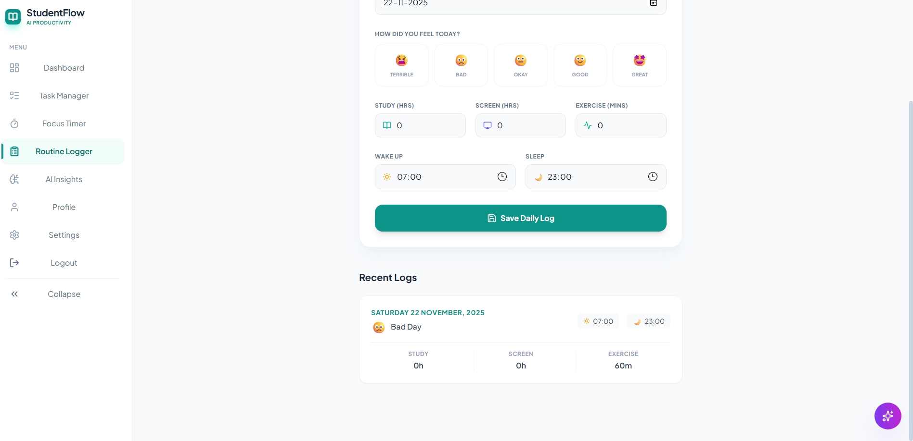

### ✔ Persistence After Refresh  

### ✔ Routine Logger Overview  

**Status:** ✔ PASS

---

# 6️⃣ **AI Insights (Smart Planner) Testing**

### ✔ **AI Insights Page Loaded**

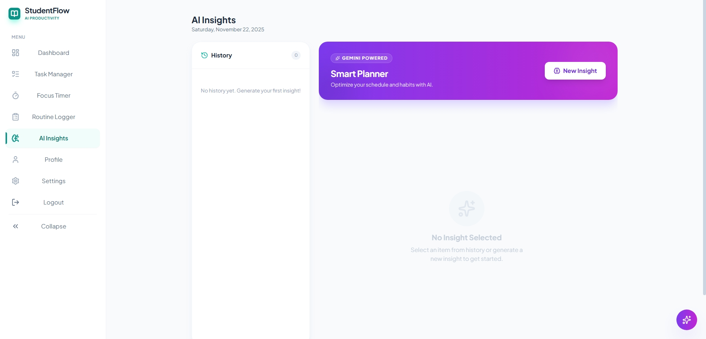

### ✔ **Valid Prompt Response**
Prompt: *“Create a 2-hour study plan for maths.”*  

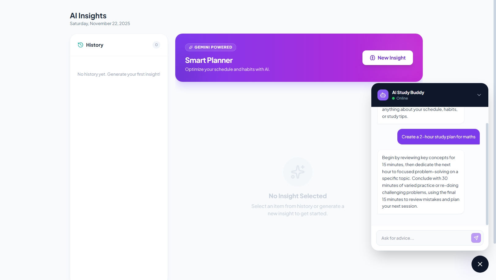

### ✔ **General AI Insights**

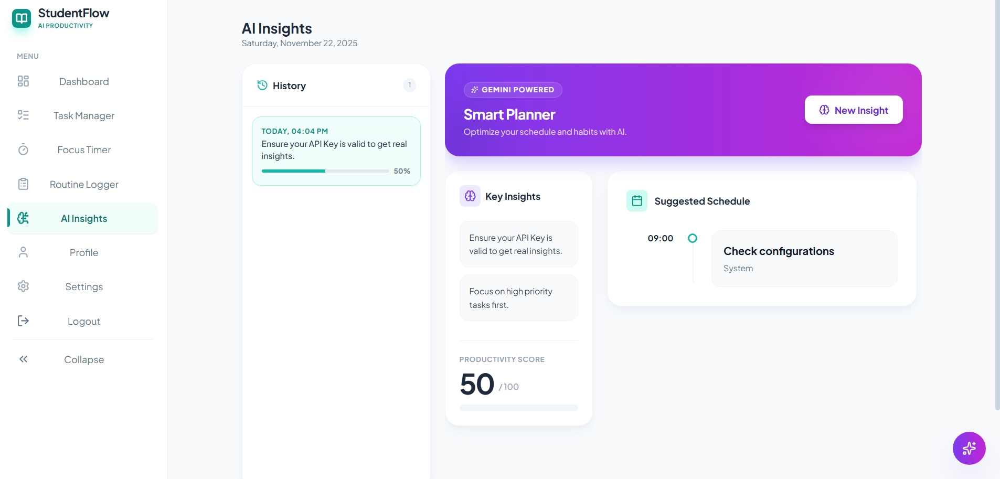

**Status:** ✔ PASS  
AI module responds correctly with meaningful content.

---

# 7️⃣ **Profile Page Testing**

### ✔ Profile Page  

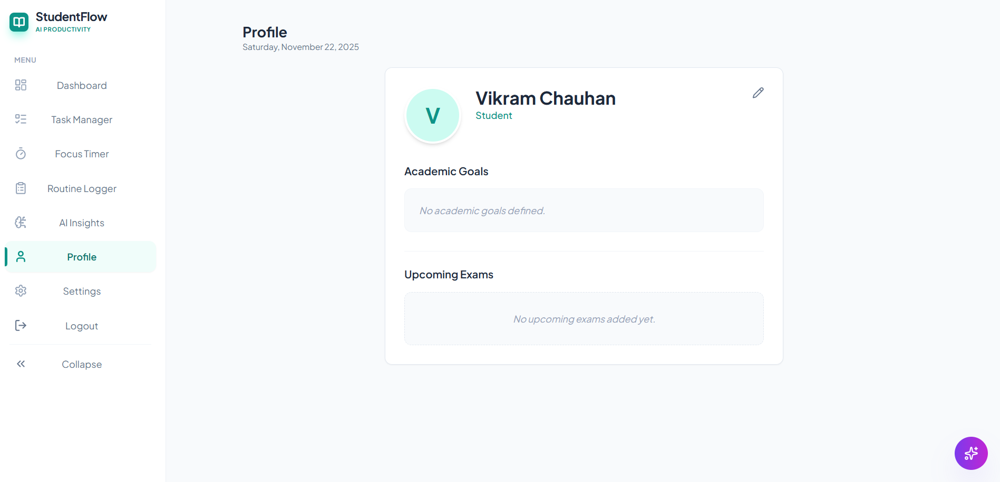

### ✔ Edit Profile Section  

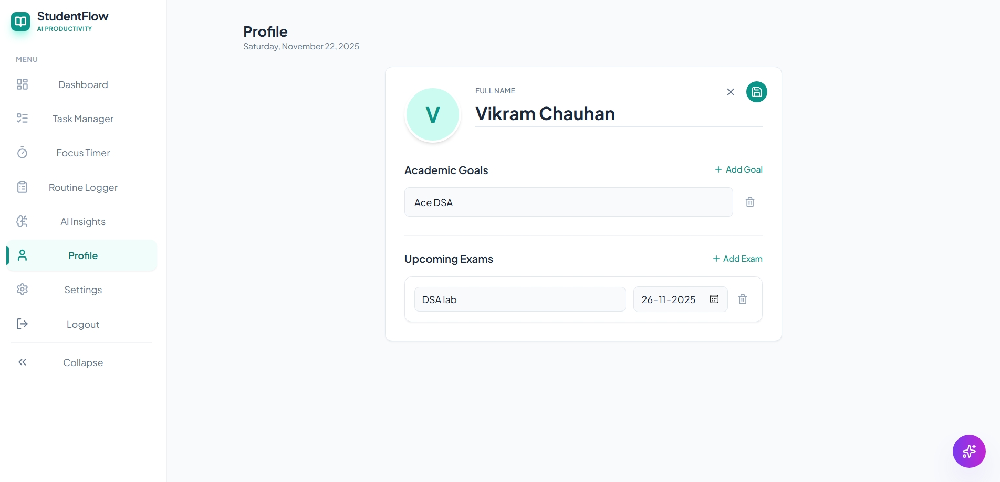

**Status:** ✔ PASS

---

# 8️⃣ **Settings Page Testing**

### ✔ Settings Page Overview  

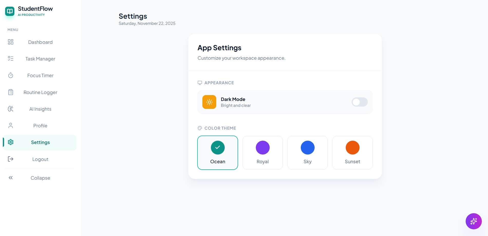

### ✔ Settings Toggles  

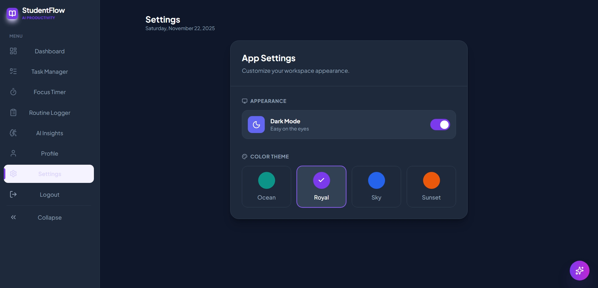

**Status:** ✔ PASS  

---

# 9️⃣ **Logout Testing**

| Test | Expected Outcome | Result |
|------|------------------|--------|
| Logout Functionality | Redirects user & ends session | ✔ PASS |

---

# 🏆 **FINAL SUMMARY**

| Module | Result |
|--------|---------|
| Dashboard | ✔ PASS |
| Task Manager | ✔ PASS |
| Focus Timer | ✔ PASS |
| Routine Logger | ✔ PASS |
| AI Insights | ✔ PASS |
| Profile | ✔ PASS |
| Settings | ✔ PASS |
| Logout | ✔ PASS |

---

# ✅ **OVERALL CONCLUSION**
StudentFlow is a **stable, fully functional, visually consistent** productivity platform ready for deployment and demonstration.

